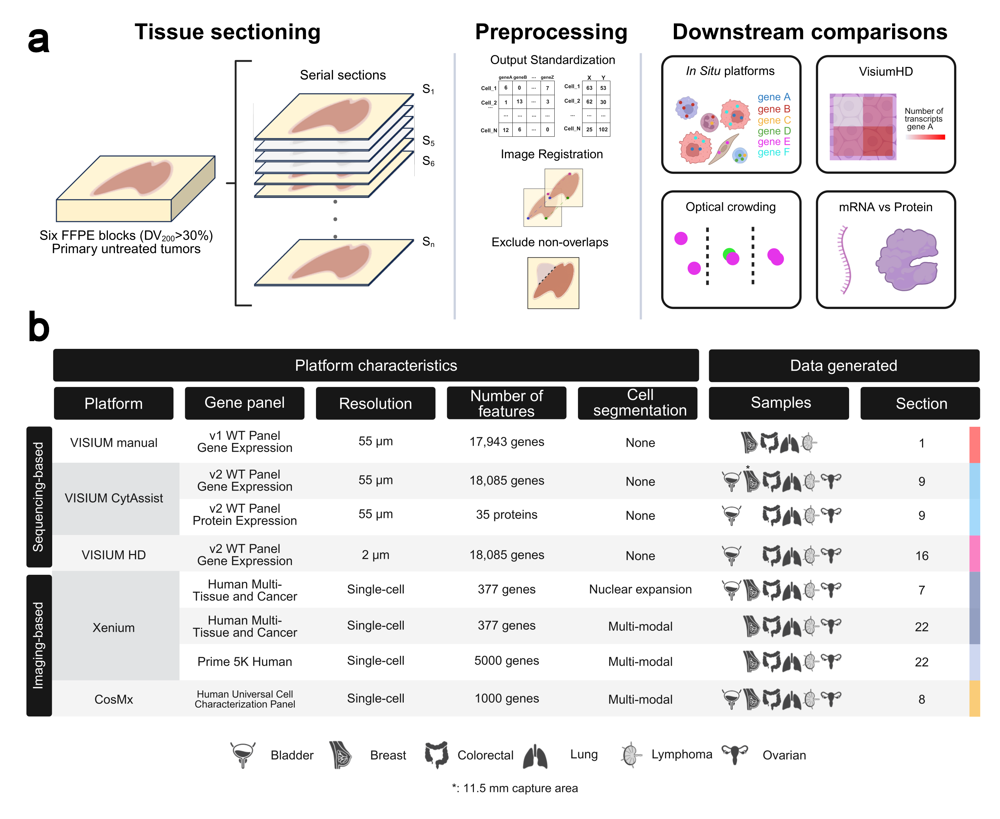

# 🧬 Benchmarking Spatial Transcriptomics Technologies Across Six Cancer Types

> **Title**: Benchmarking of spatial transcriptomics platforms across six cancer types  
> **Authors**: Sergi Cervilla*, Daniela Grases*, Elena Perez, Francisco X. Real, Eva Musulen, Julieta Aprea, Manel Esteller, Eduard Porta-Pardo  
> **Preprint (April 2025)**: https://doi.org/10.1101/2024.05.21.593407

---

## Overview

This repository contains the analysis and figure scripts used in our benchmarking study comparing multiple spatial transcriptomics platforms across six cancer types.:contentReference[oaicite:6]{index=6}

---

## Download the data

---

## Repository Structure

├── scripts/ # Data processing and utility scripts
│ ├── download_data.py # Script to fetch data from GEO/Zenodo
│ ├── preprocess.R # Preprocessing and quality control
│ └── run_metrics.py # Compute benchmarking metrics
│
├── notebooks/ # Jupyter or RMarkdown notebooks for analysis
│ ├── 01_qc.ipynb # Quality control exploration
│ ├── 02_metrics.ipynb # Platform comparison metrics
│ └── 03_visualization.ipynb # Figures and plots for manuscript
│
├── results/ # Output files: metrics, tables, and final plots
│ └── figures/ # Final figures used in the paper
│
├── env/ # Environment configuration
  └── environment.yml # Conda environment definition

---

## Contact information
- **Data Analysis**: [Sergi Cervilla] – [scervillag@carrerasresearch.org]  
- **Wet Lab Experiments**: [Daniela Grases] – [dgrases@carrerasresearch.org]  
- **Corresponding Author**: [Eduard Porta] – [eporta@carrerasresearch.org]
---
